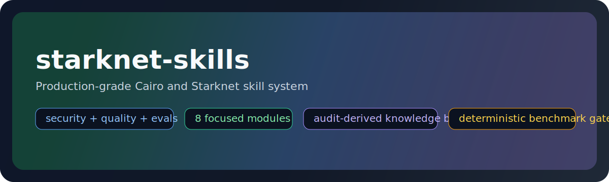

# starknet-skills

<p align="center">
  
</p>

<p align="center">
  <a href="https://github.com/keep-starknet-strange/starknet-skills/actions/workflows/quality.yml">
    
  </a>
  <a href="https://github.com/keep-starknet-strange/starknet-skills/actions/workflows/full-evals.yml">
    
  </a>
  
  
  
  
</p>

Production-grade Cairo/Starknet skills for secure coding, auditing, and regression-safe releases.

Operational tool usage belongs in `starknet-agentic`/`starkzap`; this repo is the reasoning + security knowledge layer.

## Install & Use

Claude marketplace:

```bash
/plugin marketplace add keep-starknet-strange/starknet-skills
/plugin menu
```

Local router:

```bash
git clone https://github.com/keep-starknet-strange/starknet-skills.git
# load ./SKILL.md from your agent client
```

Common invocation:

```text
/starknet-skills
/cairo-auditor
```

Direct router URL:

- [SKILL.md](https://raw.githubusercontent.com/keep-starknet-strange/starknet-skills/main/SKILL.md)

## Modules

| Module | Focus | Status |
| --- | --- | --- |
| [cairo-auditor](cairo-auditor/SKILL.md) | Deterministic + workflow-guided security review | Stable |
| [cairo-contract-authoring](cairo-contract-authoring/SKILL.md) | Language + contract implementation patterns | Stable |
| [cairo-testing](cairo-testing/SKILL.md) | Unit/integration/invariant strategy | Stable |
| [cairo-optimization](cairo-optimization/SKILL.md) | Profiling + performance/resource hardening | Stable |
| [cairo-toolchain](cairo-toolchain/SKILL.md) | Build/declare/deploy/verify ops | Stable |
| [account-abstraction](account-abstraction/SKILL.md) | Account/session-key threat patterns | Stable |
| [starknet-network-facts](starknet-network-facts/SKILL.md) | Chain semantics and constraints | Stable |

## Benchmarks

- Deterministic smoke scorecards:
  - [v0.2.0-cairo-auditor-benchmark.md](evals/scorecards/v0.2.0-cairo-auditor-benchmark.md)
  - [v0.2.0-cairo-auditor-realworld-benchmark.md](evals/scorecards/v0.2.0-cairo-auditor-realworld-benchmark.md)
  - [v0.4.0-contract-skill-benchmark.md](evals/scorecards/v0.4.0-contract-skill-benchmark.md) (reportable sample)
  - [v0.3.0-contract-skill-benchmark.md](evals/scorecards/v0.3.0-contract-skill-benchmark.md) (smoke-only baseline)
  - [contract-skill-benchmark-trend.md](evals/scorecards/contract-skill-benchmark-trend.md)
- Human-labeled external scan scorecards:
  - [v0.2.0-cairo-auditor-external-triage.md](evals/scorecards/v0.2.0-cairo-auditor-external-triage.md)
  - [cairo-auditor-external-trend.md](evals/scorecards/cairo-auditor-external-trend.md)
- Canonical benchmark surface and maintenance notes live in [cairo-auditor/README.md](cairo-auditor/README.md).

## Data Pipeline

- [datasets/README.md](datasets/README.md): `ingest -> segment -> normalize -> distill -> skillize`
- [evals/README.md](evals/README.md): held-out policy + benchmark gates

## Website

- Static site source: [website/](website/)
- Site generator: [scripts/site/build_site.py](scripts/site/build_site.py)
- Regenerate locally:

```bash
python3 scripts/site/build_site.py --domain starkskills.org
```

## Governance

- [CONTRIBUTING.md](CONTRIBUTING.md)
- [SECURITY.md](SECURITY.md)
- [CODE_OF_CONDUCT.md](CODE_OF_CONDUCT.md)
- [THIRD_PARTY.md](THIRD_PARTY.md)
- Skill contract validator: `python scripts/quality/validate_skills.py`
- Parity + eval preflight: `python scripts/quality/parity_check.py`
