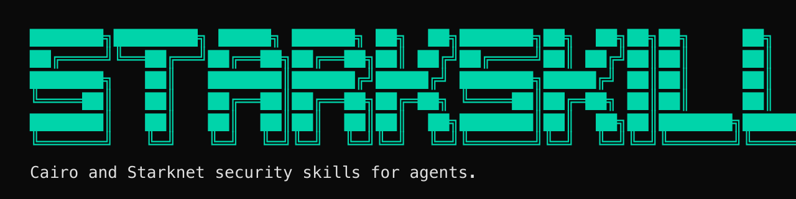

# starknet-skills

<p align="center">
  
</p>

<p align="center">
  <a href="https://github.com/keep-starknet-strange/starknet-skills/actions/workflows/quality.yml">
    
  </a>
  
  
  
  
</p>

<p align="center">
  
  
  
  
  
  
  
  
</p>

<details>
<summary><strong>All 30+ compatible tools</strong></summary>
<p align="center">
Built on the <a href="https://agentskills.io">Agent Skills</a> open standard — works with any tool that reads markdown.<br/>


</p>
</details>

<p align="center"><strong>Cairo/Starknet skills for AI coding agents</strong></p>

> Security + reasoning knowledge layer for any agent that reads markdown.
> Built on the [Agent Skills](https://agentskills.io) open standard — works with 30+ tools.
> For operational tooling, see [starknet-agentic](https://github.com/keep-starknet-strange/starknet-agentic).

## Install & Use

### Claude Code

```bash
/plugin marketplace add keep-starknet-strange/starknet-skills
/plugin install starknet-skills
```

Then try:

```text
Audit src/contract.cairo using the cairo-auditor skill
```

### Cursor

Clone the repo and add it as a context directory in Cursor settings (or load the router URL directly):

```bash
git clone https://github.com/keep-starknet-strange/starknet-skills.git
```

Open the cloned directory in Cursor (or add it as a context directory in settings). Then try:

```text
Write an ERC20 token contract following the cairo-contract-authoring skill
```

### Gemini CLI

Pass the router URL when you start a session:

```bash
gemini --skill https://raw.githubusercontent.com/keep-starknet-strange/starknet-skills/main/SKILL.md
```

### VS Code (GitHub Copilot)

Clone the repo into your workspace, then provide the router URL in Copilot chat via `@workspace` (or add it as custom context in VS Code settings):

```bash
git clone https://github.com/keep-starknet-strange/starknet-skills.git
```

```text
https://raw.githubusercontent.com/keep-starknet-strange/starknet-skills/main/SKILL.md
```

### OpenAI Codex

Auto-discovered via `AGENTS.md` at the repo root. Clone and open — Codex reads agent instructions automatically.

### JetBrains (Junie)

Clone the repo into your project. Junie reads `SKILL.md` files from the workspace:

```bash
git clone https://github.com/keep-starknet-strange/starknet-skills.git
```

### Any agent (universal)

Paste this URL into your agent's chat or config — it auto-routes to the right skill:

```text
https://raw.githubusercontent.com/keep-starknet-strange/starknet-skills/main/SKILL.md
```

Or load a specific skill directly:

```text
https://raw.githubusercontent.com/keep-starknet-strange/starknet-skills/main/cairo-auditor/SKILL.md
https://raw.githubusercontent.com/keep-starknet-strange/starknet-skills/main/cairo-contract-authoring/SKILL.md
https://raw.githubusercontent.com/keep-starknet-strange/starknet-skills/main/cairo-testing/SKILL.md
https://raw.githubusercontent.com/keep-starknet-strange/starknet-skills/main/cairo-optimization/SKILL.md
```

Machine-readable index: [`llms.txt`](llms.txt)

## Example Prompts

After installing, try these in any agent:

| What you want | What to type |
|---------------|-------------|
| Audit a contract | `Audit src/vault.cairo for security issues using cairo-auditor` |
| Write a new contract | `Write an upgradeable ERC721 with Ownable using cairo-contract-authoring` |
| Add tests | `Add unit and fuzz tests for src/vault.cairo using cairo-testing` |
| Optimize gas | `Profile and optimize the transfer function using cairo-optimization` |
| Full pipeline | `Write a staking contract, test it, then audit it` |

The agent reads the skill, follows its orchestration steps, and produces structured output (findings report, test suite, optimized code, etc.).

## First Local Audit (60s)

```bash
python scripts/quality/audit_local_repo.py \
  --repo-root /path/to/your/cairo-repo \
  --scan-id local-audit
```

Optional Sierra confirmation (trusted repos only):

```bash
python scripts/quality/audit_local_repo.py \
  --repo-root /path/to/your/cairo-repo \
  --scan-id local-audit-sierra \
  --sierra-confirm \
  --allow-build
```

Warning: `--allow-build` may execute repository build steps/tooling.
Use build mode only on trusted code, or run in an isolated environment.

Reports are written under `<repo-root>/evals/reports/local/` by default (`.md`, `.json`).
Add `--write-findings-jsonl` to emit `.findings.jsonl`.
If a target filename already exists, the script appends `-N` to avoid overwrite.

## Skill Modules

| Module | What LLMs Commonly Miss |
| --- | --- |
| [cairo-auditor](cairo-auditor/SKILL.md) | Misses Starknet upgrade/account edge cases and weak FP gates |
| [cairo-contract-authoring](cairo-contract-authoring/SKILL.md) | Applies Solidity structure directly to Cairo components |
| [cairo-testing](cairo-testing/SKILL.md) | Stops at unit tests and skips invariants/adversarial regression coverage |
| [cairo-optimization](cairo-optimization/SKILL.md) | Optimizes wrong paths without trace/Sierra context |
| [cairo-toolchain](cairo-toolchain/SKILL.md) | Uses stale Scarb/snforge/sncast workflows |
| [account-abstraction](account-abstraction/SKILL.md) | Misses session-key/self-call and validation-flow pitfalls |
| [starknet-network-facts](starknet-network-facts/SKILL.md) | Hallucinates network semantics and fee/timing assumptions |

Recommended sequence for new contracts: `cairo-contract-authoring` -> `cairo-testing` -> `cairo-auditor`.

## Data Pipeline

```text
ingest -> segment -> normalize -> distill -> skillize
  24        26         217          9          7
audits   corpora    findings     assets     skills
```

> Snapshot counts are maintainer-updated. When normalized findings change, update
> this table and badge labels together.

- Ingest manifest: [`datasets/manifests/audits.jsonl`](datasets/manifests/audits.jsonl)
- Normalized findings: [`datasets/normalized/findings/`](datasets/normalized/findings)
- Distilled assets: [`datasets/distilled/`](datasets/distilled)
- Router skill index: [`SKILL.md`](SKILL.md)

## Quality Signals

Deterministic benchmarks are **smoke/regression gates**, not final proof of auditor quality.

- Deterministic smoke:
  - [v0.2.0-cairo-auditor-benchmark.md](evals/scorecards/v0.2.0-cairo-auditor-benchmark.md)
  - [v0.2.0-cairo-auditor-realworld-benchmark.md](evals/scorecards/v0.2.0-cairo-auditor-realworld-benchmark.md)
- Human-labeled external triage:
  - [v0.2.0-cairo-auditor-external-triage.md](evals/scorecards/v0.2.0-cairo-auditor-external-triage.md)
  - [cairo-auditor-external-trend.md](evals/scorecards/cairo-auditor-external-trend.md)
- Manual gold recall:
  - [v0.2.0-cairo-auditor-manual-19-gold-recall.md](evals/scorecards/v0.2.0-cairo-auditor-manual-19-gold-recall.md)
- Contract-skill benchmark:
  - [v0.5.0-contract-skill-benchmark.md](evals/scorecards/v0.5.0-contract-skill-benchmark.md)
  - [v0.4.0-contract-skill-benchmark.md](evals/scorecards/v0.4.0-contract-skill-benchmark.md)
  - [contract-skill-benchmark-trend.md](evals/scorecards/contract-skill-benchmark-trend.md)
- KPI publication gate:
  - [contract-kpi-publication-gate.md](evals/scorecards/contract-kpi-publication-gate.md)

## Methodology

Skills are authored from audit-backed source material, then checked with deterministic gates and held-out evaluation policy before landing. The goal is reusable, high-signal corrections for common Cairo/Starknet failure modes, not generic documentation.

Current workflow:
- `quality.yml` is the required per-PR gate.
- `full-evals.yml` runs on schedule/workflow dispatch and auto-triggers on `pull_request` events (`opened`, `synchronize`, `reopened`, `ready_for_review`) when touched paths match `SKILL.md`, `**/SKILL.md`, `**/references/**`, `evals/**`, `scripts/quality/**`, or `.github/workflows/**`.
- Build-side generation eval tracks contract authoring quality (`prompt -> generated code -> build/test/static checks`) as informational telemetry in `full-evals.yml`.
- External triage trends live under [`evals/scorecards/`](evals/scorecards).
Evaluation policy: [evals/README.md](evals/README.md)

## Website

- Site: [starkskills.org](https://starkskills.org)
- Source: [website/](website/)
- Generator: [scripts/site/build_site.py](scripts/site/build_site.py)

## Contributing

See [CONTRIBUTING.md](CONTRIBUTING.md), [SECURITY.md](SECURITY.md), and [THIRD_PARTY.md](THIRD_PARTY.md).

Core local gates:
- `python3 scripts/quality/validate_skills.py`
- `python3 scripts/quality/validate_marketplace.py`
- `python3 scripts/quality/parity_check.py`

## License

MIT
