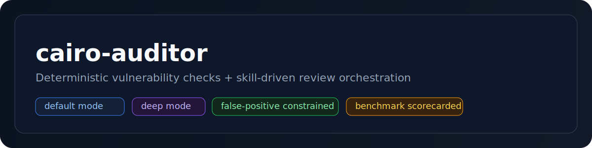

<p align="center">
  
</p>

# cairo-auditor

Flagship Cairo/Starknet security review skill.

<p>
  
  
  
  
  
</p>

## Usage

```bash
# default repo scan
/cairo-auditor

# deep adversarial pass
/cairo-auditor deep

# targeted scan
/cairo-auditor contracts/account.cairo
```

## Structure

- `SKILL.md`: orchestration policy + output contract.
- `workflows/`: default/deep execution steps.
- `agents/`: vector and adversarial sub-agent playbooks.
- `references/vulnerability-db/`: canonical vulnerability classes.
- `references/audit-findings/`: distilled audit-derived findings.
- `scripts/`: extraction and normalization helpers.

## Benchmarks

| Suite | Cases | Precision | Recall | Scorecard |
| --- | ---: | ---: | ---: | --- |
| Core deterministic | 12 | 1.000 | 1.000 | [v0.2.0-cairo-auditor-benchmark.md](../evals/scorecards/v0.2.0-cairo-auditor-benchmark.md) |
| Real-world corpus | 11 | 1.000 | 1.000 | [v0.2.0-cairo-auditor-realworld-benchmark.md](../evals/scorecards/v0.2.0-cairo-auditor-realworld-benchmark.md) |

Case packs:

- [cairo_auditor_benchmark.jsonl](../evals/cases/cairo_auditor_benchmark.jsonl)
- [cairo_auditor_realworld_benchmark.jsonl](../evals/cases/cairo_auditor_realworld_benchmark.jsonl)

## References

- Module policy: [SKILL.md](SKILL.md)
- Vulnerability classes: [references/vulnerability-db/README.md](references/vulnerability-db/README.md)
- Release gate checklist: [references/checklists/release-gate.md](references/checklists/release-gate.md)
